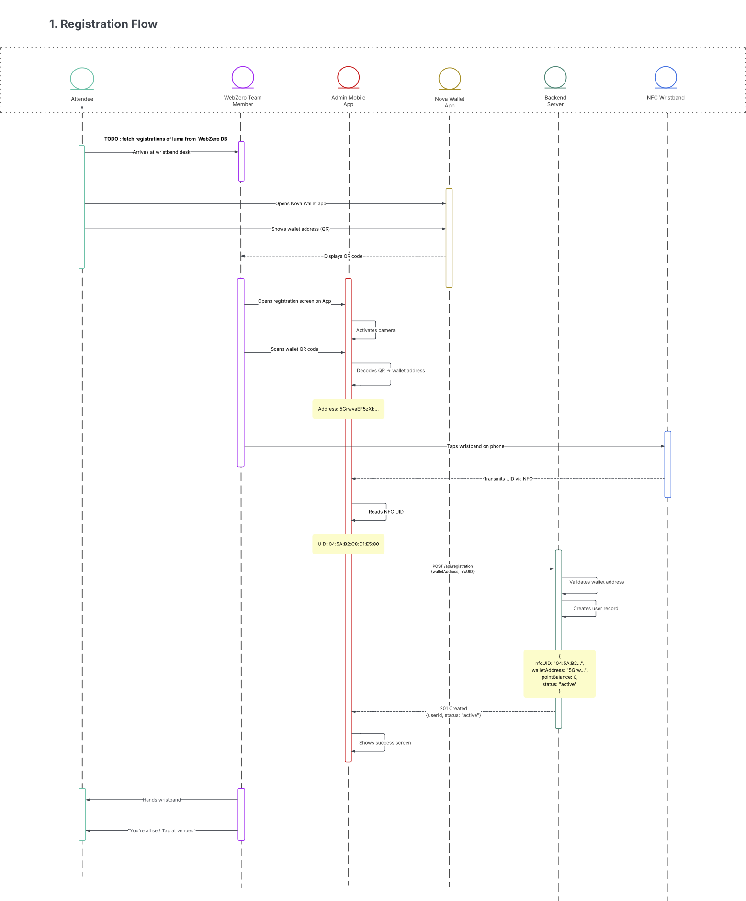
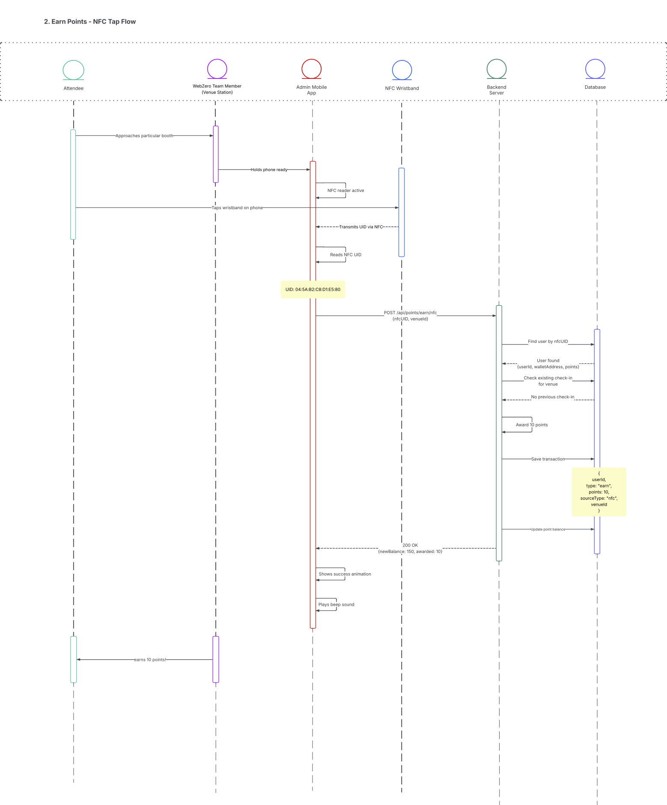
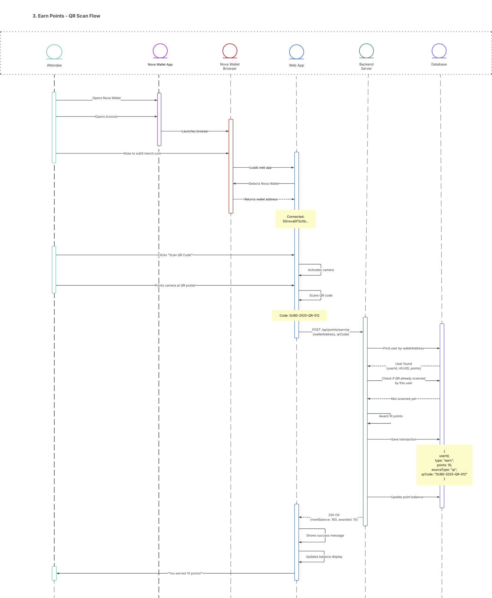
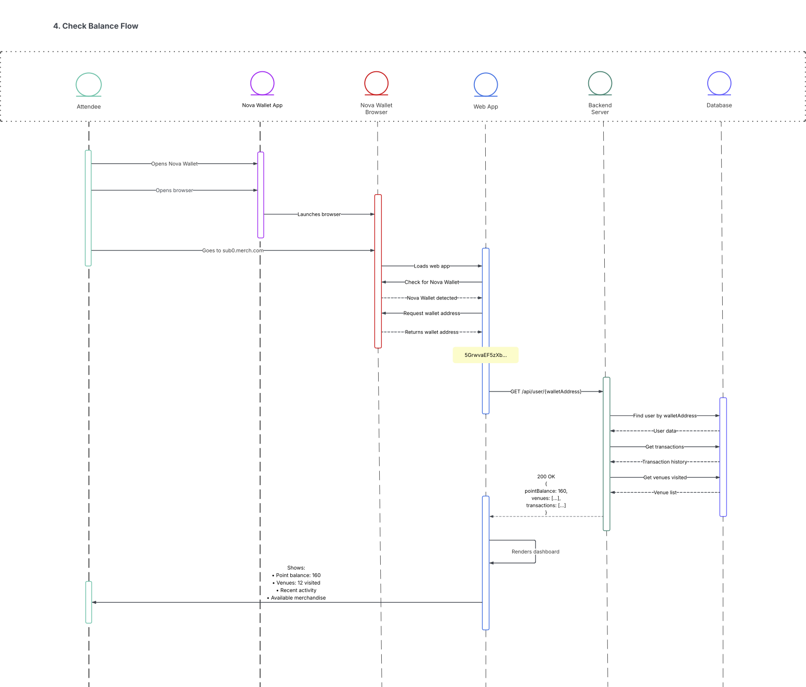
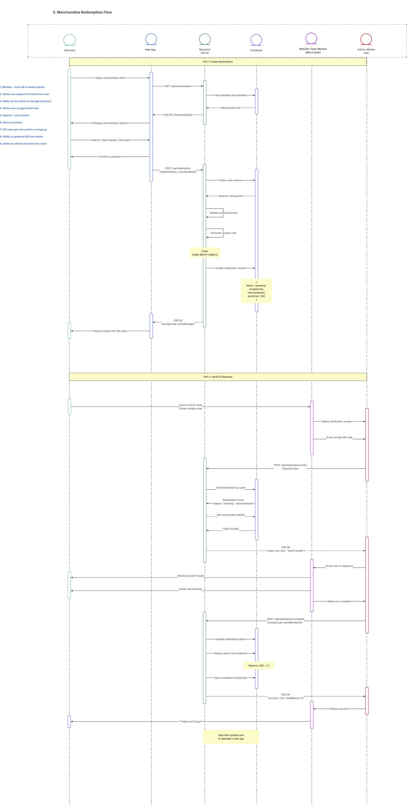

# SubZero

Android app for event attendee registration with Luma API integration, QR code scanning, and offline storage.

## Features

- Download attendee lists from Luma events
- QR code scanning for registration
- Offline access with Room database
- Material Design 3 UI

## Requirements

- Android 11 (API 30) or higher
- Luma Plus subscription for API access

## Quick Start

1. **Build & Install**
   ```bash
   ./gradlew installDebug
   ```

2. **Configure Luma Sync**
   - Get API key from [Luma Settings](https://lu.ma/settings/api)
   - Open Settings tab in app
   - Enter API key and Event ID
   - Click "Download Attendees"

3. **View Attendees**
   - Navigate to Users tab to see synced data

## Tech Stack

- Jetpack Compose
- Room Database
- Retrofit + OkHttp
- CameraX + ML Kit
- Kotlin Coroutines

## Build

```bash
./gradlew build          # Build project
./gradlew test           # Run tests
./gradlew lint           # Lint checks
```
#####
Project Video Link

```
https://drive.google.com/drive/folders/1dKv4vjnRAWc8SUgzrz5-Ih71f2VjxmMf?usp=sharing
```

###
Project Workflows

Registration Flow:




Collecting points at activations with NFC tap:



Collecting points at activations with QR scan:



Viewing balances:




Paying for things with points:

